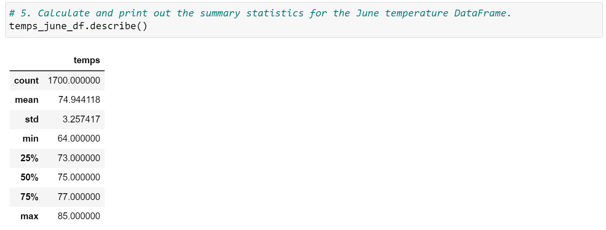
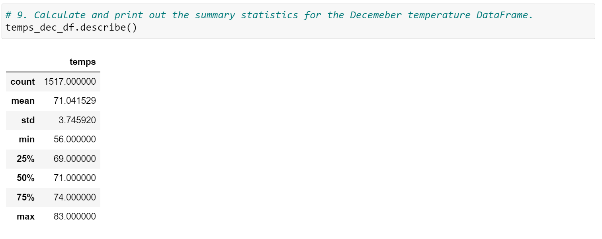

# surfs_up

#### Christopher Madden

---


## Software

- Python 3.9.7

- Jupyter Notebook 6.4.5

- VS Code 1.66.2

- Anaconda 4.12.0

  -  conda-build version : 3.21.6

---

## Purpose

The purpose of the analysis is to determine if an ice cream shop business in Oahu could be profitable year round by comparing data from June and December.

## Analysis

Using a flask application, I gathered statistical data as shown below:

```python

def stats(start=None, end=None):
    sel = [func.min(Measurement.tobs), func.avg(Measurement.tobs), func.max(Measurement.tobs)]

    if not end:
        results = session.query(*sel).\
            filter(Measurement.date >= start).all()
        temps = list(np.ravel(results))
        return jsonify(temps)

    results = session.query(*sel).\
        filter(Measurement.date >= start).\
        filter(Measurement.date <= end).all()
    temps = list(np.ravel(results))
    return jsonify(temps)

```

Here are images of the resulting summary statistics:


The three key differences in weather between June and December:

  1. Average temperatures between June and December are 75 and 71 degrees respectively.  There is little variation year-round in overall temperature.

  2. Maximum temperatures between June and December, 85 and 83, also demonstrate stable temperature patterns throughout the year.

  3. The coldest temperatures experienced are the minimum temperatures in December, which may not be good for ice cream sales.  December also has the highest standard deviation of temperatures, so probably the most unpredictable weather.

In summary, the temperature data seems to support the prospect of opening a successful shop in Oahu.

I would recommend two additional queries: 
  1. Examinine precipitation data as .  Although temperatures in the Oahu climate are relatively stable, perhaps there is a rainy season and a dry season.
  2. Examine tourist flow throughout the year.  Perhaps there are slower and busier seasons.

An additional recommendation would be to gather monthly data and examine all twelve months of the year for a more detailed analysis.

---

## -----NEW-----


# Surfs Up — Weather & Business Viability Analysis | Python, SQLite, Flask

**Christopher Madden** | [LinkedIn](http://bit.ly/4uMMPV7) | [GitHub Portfolio](https://bit.ly/3Pz5LS3)

---

## Project Overview

This project uses Python, SQLAlchemy, and Flask to query and analyze historical weather data stored in a SQLite database, with the goal of evaluating whether an ice cream and surf shop business in Oahu, Hawaii could be profitable year-round. The core question: are temperature conditions stable enough across seasons to support a consistent customer base?

June and December were selected as representative peak summer and winter months for comparative statistical analysis.

This is a portfolio project completed as part of my Data Analytics Certificate program at Case Western Reserve University (2022).

---

## Tools & Skills Demonstrated

- **Language:** Python
- **Libraries:** SQLAlchemy, Flask, Pandas, NumPy, Matplotlib
- **Database:** SQLite (`hawaii.sqlite`)
- **Environment:** Jupyter Notebook
- **Techniques:** ORM querying, statistical summary analysis, API endpoint development, seasonal comparison
- **Competencies:** Data extraction, descriptive statistics, business-driven analysis, Flask API design

---

## Dataset

- **Source:** `hawaii.sqlite` — historical weather station data for Oahu, Hawaii
- **Key variable:** `tobs` (temperature observations in °F)
- **Comparison periods:** June vs. December across all available years

---

## Analysis

A Flask API was built to serve statistical data from the SQLite database, enabling dynamic querying by date range:

```python
def stats(start=None, end=None):
    sel = [func.min(Measurement.tobs), func.avg(Measurement.tobs), func.max(Measurement.tobs)]
    results = session.query(*sel).filter(Measurement.date >= start).all()
    return jsonify(list(np.ravel(results)))
```

### June Temperature Summary


### December Temperature Summary


### Key Findings

| Metric | June | December |
|--------|------|----------|
| Average Temp (°F) | 75 | 71 |
| Max Temp (°F) | 85 | 83 |
| Min Temp (°F) | 64 | 56 |

Three notable observations:
1. Average temperatures differ by only 4°F between June and December — strong indicator of year-round stability
2. Maximum temperatures are nearly identical (85°F vs. 83°F), suggesting peak conditions persist through winter
3. December shows greater variability and lower minimums, which could impact sales on colder days — the primary business risk

---

## Business Conclusion

The temperature data supports the viability of a year-round surf and ice cream shop in Oahu. The climate is notably stable compared to most markets.

**Recommended additional analyses:**
1. Precipitation patterns — temperature alone doesn't tell the full story; a rainy season could suppress foot traffic even in warm months
2. Tourist volume by month — understanding seasonal visitor flow would refine revenue projections and staffing models
3. Full 12-month granular analysis — monthly breakdowns would reveal any short-term dips not visible in June/December comparisons

---

## Repository Structure

```
surfs_up/
├── SurfsUp_Challenge.ipynb     # June vs December temperature analysis
├── climate_analysis.ipynb      # Exploratory climate analysis
├── app.py                      # Flask API application
├── hawaii.sqlite               # Source weather database
├── Resources/                  # Supporting data files
├── analysis/                   # Output charts and summary statistics
└── README.md
```

---

## About the Author

I am a Data Analyst with experience in SQL, Python, R, Power BI, Tableau, and Excel. I specialize in data cleaning, statistical analysis, dashboard development, and translating complex data into clear business insights.

📧 maddenc33@gmail.com | [LinkedIn](http://bit.ly/4uMMPV7) | [GitHub](https://bit.ly/3Pz5LS3)
